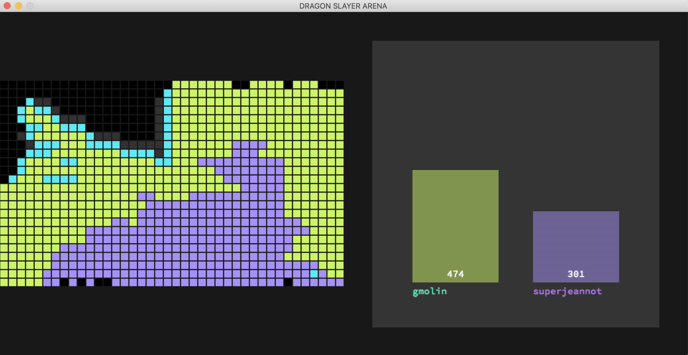

# 42-filler

In this project I had to create a player (bot) that will fight other bots on the famous (or not) Filler board. The rules are simple: two players fight on a board and, in turn, must place the piece given to them by the game master (a Ruby executable), thereby scoring points. 
The game ends when a piece cannot be placed. A small fun game project.

# Usage
```
git clone https://github.com/avocadohooman/42-filler.git | cd 42-filler
cd resources & ./filler_vm -f maps/map02 -p1 players/gmolin.filler -p2 players/superjeannot.filler | ./visual
```

# Notes by the Creator
The algorithm used for this project is pretty effective, but not efficient. I decided to stop working on the algorithm as soon as I achieved an average winning ration of 80% against all bots on all maps.

For future developments:
- Improve efficency and speed by improving placing strategy (placing first closer to the enemy, then fill the rest of the field)

# Preview


